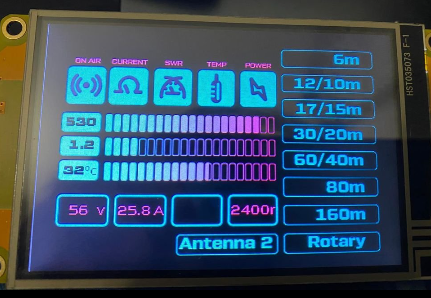

UPCOMING Task:

TFT file for 5 inch display uploaded.

V 1.5
Bug fixed. Touch disabled when TX.

V 1.4
Arduino-LDMOS-SSPA-Controller-v1.4.ino
Pin assignment corrected for PCB V1.1

V 1.3
Arduino-LDMOS-SSPA-Controller-v1.3.ino
Arduino LDMOS SSPA controller with Nextion HMI display

Features:
* Arduino Nano [easy code to understand]
* Max watt, max SWR, Max Temp for Bar graph settings can be changed in Arduino code.
* Display Power output in bar graph and numeric
* Display SWR in bar graph and numeric
* Display Temp in bar graph and numeric
* Display Band in Numeric, also band button shows current display. Touch button for band selection.
* Antenna 2 selection (optional - currently no GPIO left)
* Shows FAN speed (LOW/MID/HIGH/HOT/ALRM)
* Band change by 8 pole rotary band switch (position 1 will enable touch switch).
* No Band change when TX on, if you change band switch or select different band from touch - it will change when TX goes of.
* PWM FAN control depends on temperature.
* Temp sensor DS18B20 3 pin IC
* Volt monitor.
* Current monitor from DXWORLD-E protection board (BTS.....)
* Shows SWR/High Po/High current LED status on LCD
* Shows PTT status (on air)
* Shutdown bias V at 54.9 Degree (you can set it)
* Shows operator callsign on front display (change it inside Arduino code)
* For touch band selection, band change memorize in eeprom, comes back same band after power on or reset.

If you need any clarification or help look for me in qrz.com

Enjoy, 73, S21RC
